# oci-monitoring

# OCI Monitoring Lab

## <a name="overview">Introdução</a>
Neste guia, trabalharemos na disseminação e criação de diversos conceitos de monitoramento voltados à Oracle Cloud, seguindo diferentes processos e boas técnicas de implementação.

Exploraremos diversos recursos de monitoramento disponíveis na Oracle Cloud. É importante que o usuário possua um conhecimento prévio de OCI, e de preferência tenha participado ou esteja participando de nosso workshop inicial (OCI Fast Track).

Por meio deste guia, trabalharemos com:

- Metricas
- Tópicos
- Alertas e dashboards

As chaves SSH para acessso as instâncias ```servidor-http01``` e ```servidor-http02```, que serão criadas neste deploy, estão no diretório ```oci-monitoring/stack/ssh-keys```.

Nosso objetivo é que, ao final deste workshop, os participantes possam ter o conhecimento na prática para implementar e manter a observabilidade dos seus ambientes na OCI.


## <a name="Tarefa 1: Deploy do ambiente básico">Tarefa 1: Deploy do ambiente básico</a>

[](https://cloud.oracle.com/resourcemanager/stacks/create?zipUrl=https://github.com/guilhermesilvadev/oci-security/archive/refs/tags/1.0.zip)<br>
*If you are logged into your OCI tenancy in the Commercial Realm (OC1), the button will take you directly to OCI Resource Manager where you can proceed to deploy. If you are not logged, the button takes you to Oracle Cloud initial page where you must enter your tenancy name and login to OCI.*
<br>

## <a name="OCI Monitoring">OCI Monitoring </a>

O WAF é um serviço de segurança global compatível com PCI (Payment Card Industry) que protege aplicativos de tráfego malicioso e indesejado na internet.
Objetivos
- Configurar um WAF com o Load Balancer do workshop anterior
- Trabalhar com regra de Controle de Acesso
- Testar

### <a name="Tarefa 1: Criar o tópico">Tarefa 1: Criar o tópico</a>
1. Acesse o menu hambuger => **Developer Services**

2. Clique na opção **Notifications**, terceira opção abaixo da sessão “Application Integration”
   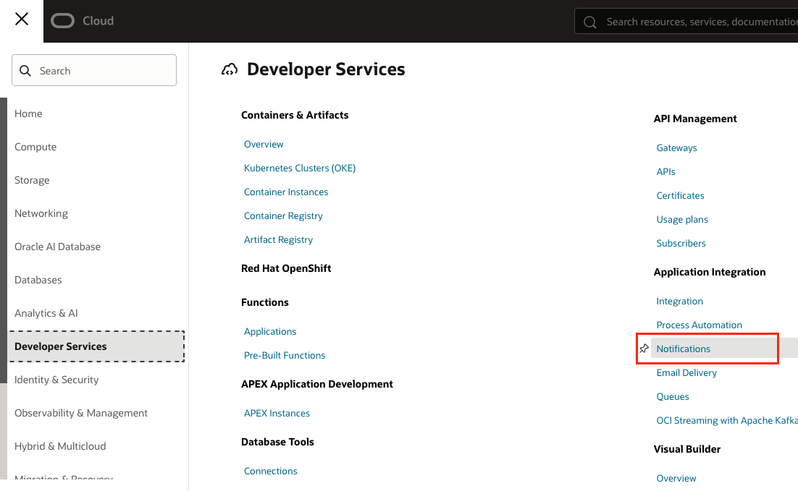

3. Clique na opção **Create Topic**
   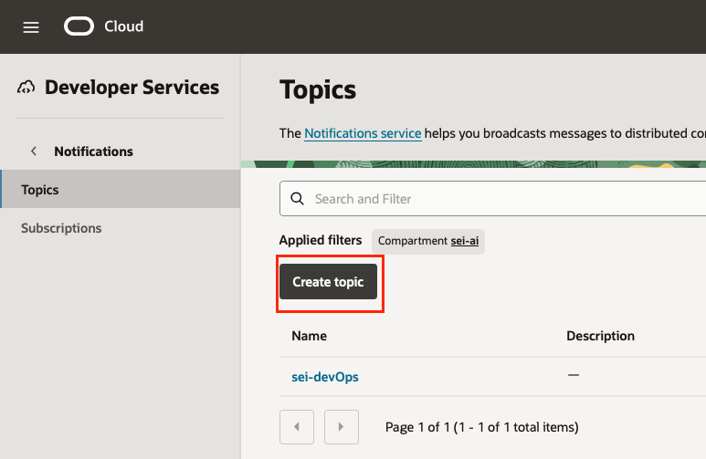

4. No campo *Name**, preencher com o valor ``lab_monitoramento_topic``

5. No campo *Description**, preencher com o valor **Grupo de notificação de monitoramento** . Ao final da página clique no botão **Create**
   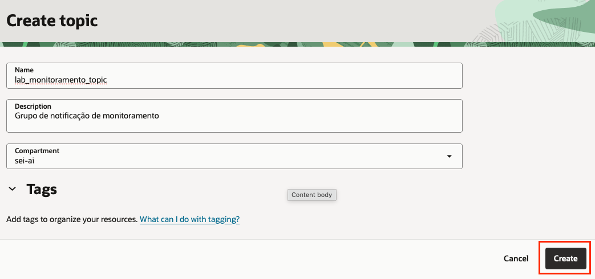

6. Clique no tópico que acabamos de criar, *lab_monitoramento_topic**
   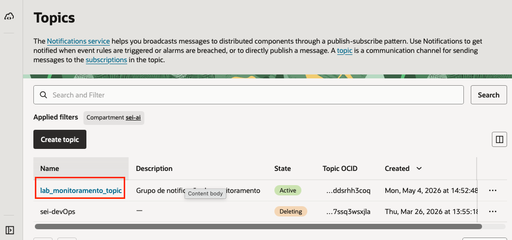

7. Selecione a opção **Subscription** e clique no botão **Create subscription**
   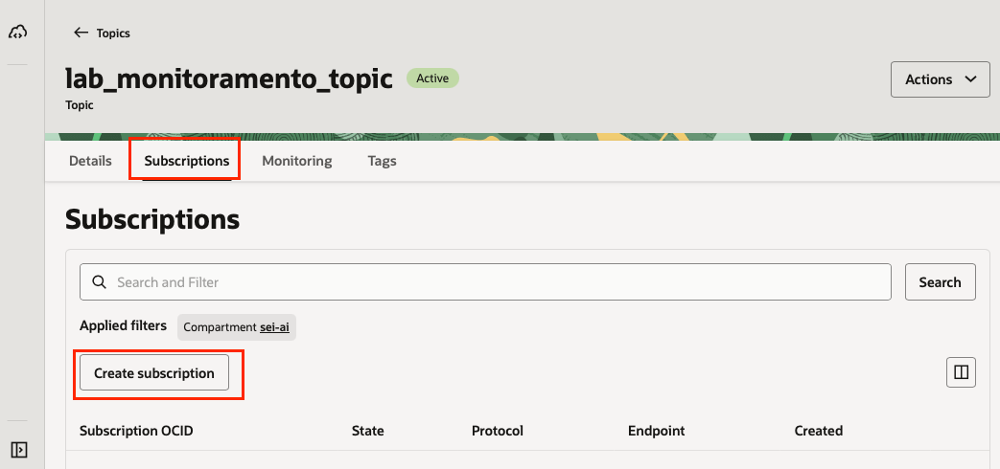

8. Preecha o campo e-mail com seu endereço de e-mail, este será o e-mail que será notificado quando um aletar for criado. Em seguida clique no campo **create**
   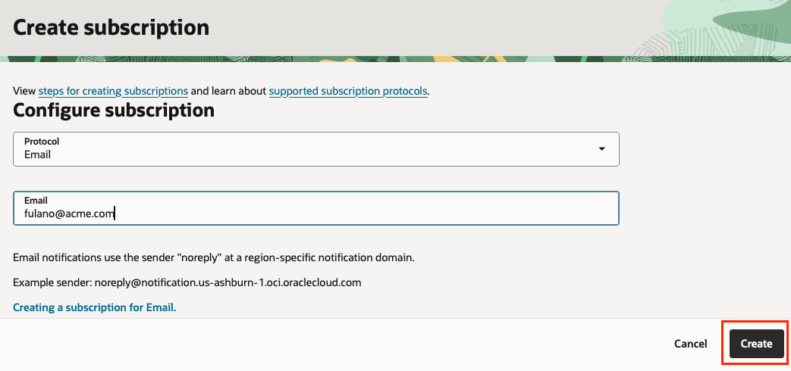

9.  Note que o status está **pending**, isso se deve ao usuário do e-mail informando ainda não ter se inscrito no tópico
   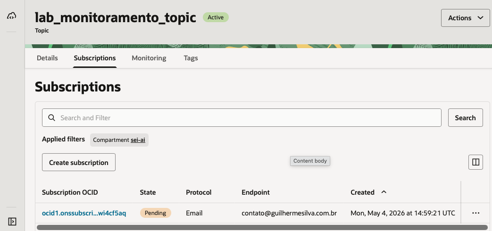

10.  Abra a caixa de e-mail informando no passo 8 e você verá um e-mail com o títuli **Oracle Cloud Infrastructure Notifications Service Subscription Confirmation**. Abra o e-mail e clique no botão **confirm subscription**.

11. Após a confirmação da subscrição, o status que antes estava **pending** agora está **active**
   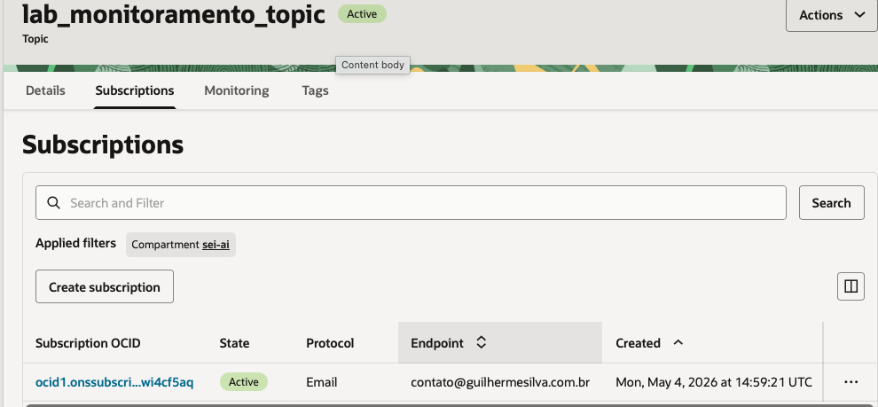


### <a name="Tarefa 2: Criar o alarme">Tarefa 2: Criar o alarme</a>

1. Acesse o menu hambuger => Obervavility & Management => Alarm Definitions
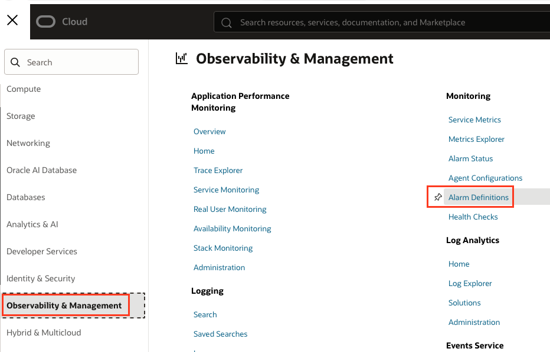

2. Clique no botão **Create Alarm**
3. No campo name informe ``CPU_Utilization``
4. Na sessão **Metric description** informe:
   1. Compartment: Compartmet onde foi criado as instâncias HTTP
   2. Metric namespace: oci_computeagent
   3. Resource group: Não alterar
   4. Metric Name: CpuUtilization
   5. Interval: 1 minute
   6. Static: mean
5. Na sessão **Trigger rule 1** informe:
   1. Operator: greater than or equal to
   2. Value: 1
   3. Trigger delay minutes: 75
   4. Alarm Severity: Warning
   5. Alarm body: {{severity}}, alarm triggered because the instance {{dimensions.resourceDisplayname}} reach 75% of CPU utilization at {{timestamp}}
6. clicar em **Additional trigger rule**
7. Na sessão **Trigger rule 2** informe:
   1. Operator: greater than or equal to
   2. Value: 1
   3. Trigger delay minutes: 90
   4. Alarm Severity: Critical
   5. Alarm body: {{severity}}, alarm triggered because the instance {{dimensions.resourceDisplayname}} reach 90% of CPU utilization at {{timestamp}}
   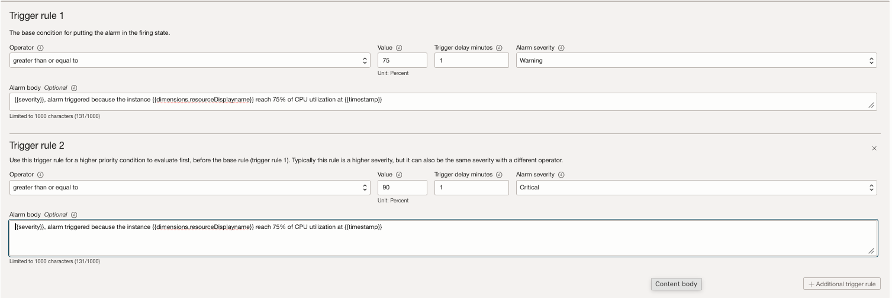
8. Na sessão **Define alarm notifications** informar
   1.  Destination service: notification
   2.  Topic: selecionar o tópico criado na task 1.
   3.  Notification subject: High CPU Utilization
  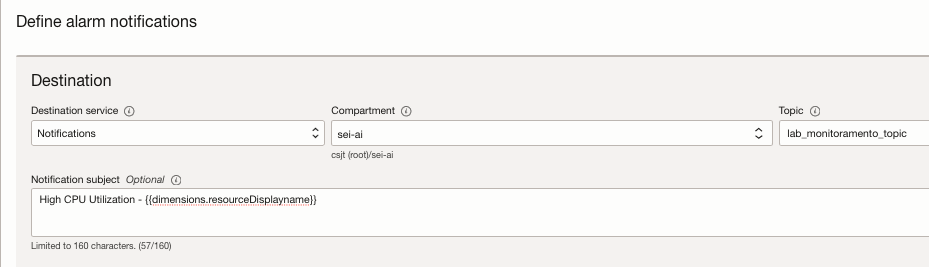

### <a name="Tarefa 3: Disparando o alarme">Tarefa 3: Disparando o alarme</a>
  
1. Realize o login SSH em uma instância
2. Instale o pacote stress-ng
```bash
sudo dnf install stress-ng
```
3. Execute o comando
```bash
sudo dnf install stress-ng
```
4. Rode o comando para gerar load de CPU
```bash
sudo stress-ng --cpu 2 -l 40 --timeout 120s
```

### <a name="Tarefa 4: Monitorando o alarme">Tarefa 4: Monitorando o alarme</a>

Antes de executar o comando do stress o status do alarme é OK
  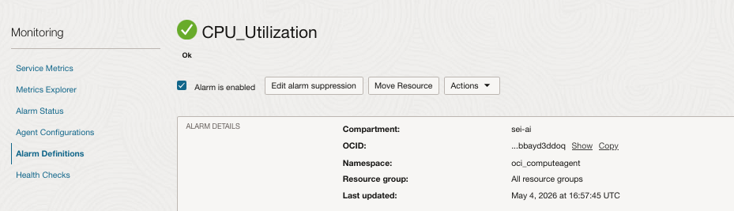

Porém com a execução do comando e a utilização de CPU o alarme muda para firing
  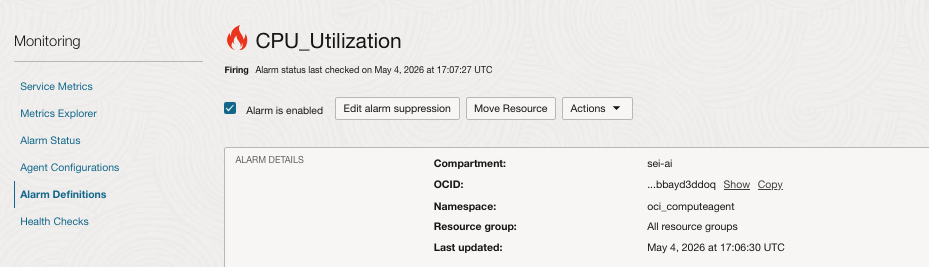

E você receberá um email com o titulo OK -> TO FIRING, isso siginifica que o recurso saiu do status de OK para Alarme
  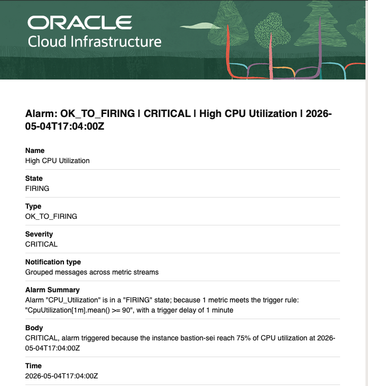

Assim que o problema for resolvido, você receberá um email com o titulo FIRING -> TO OK, isso siginifica que o recurso saiu do status de alarme praa OK.

